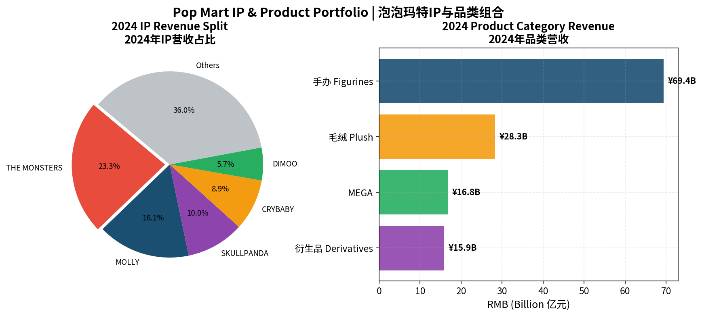
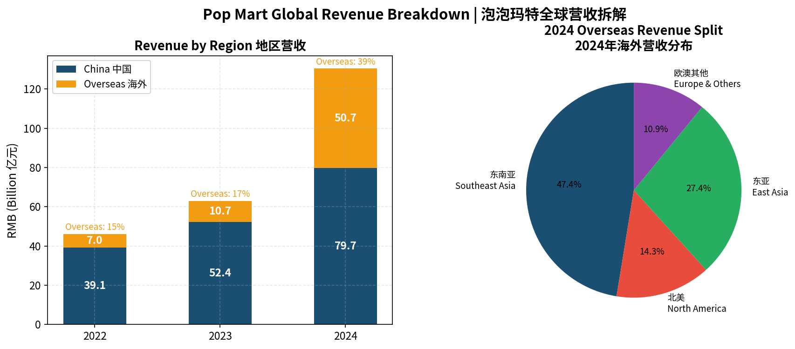
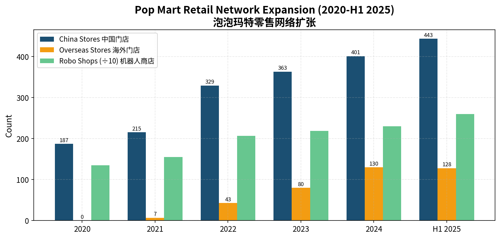
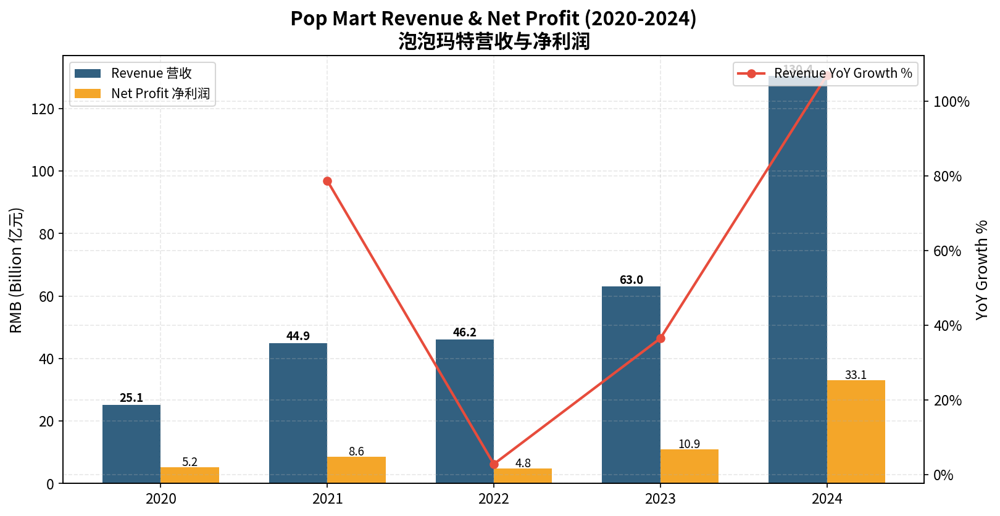
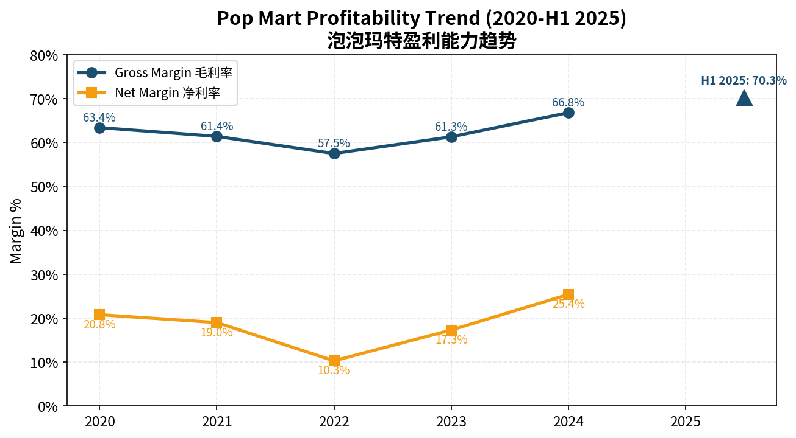
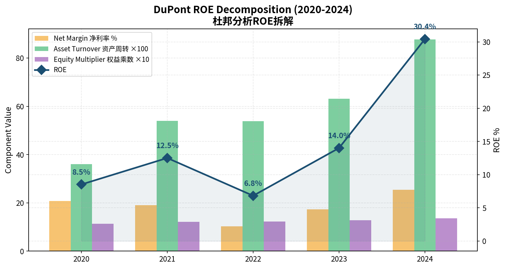
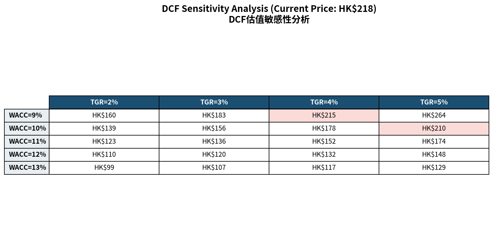

# Pop Mart International Group (9992.HK) — Equity Research Report

# 泡泡玛特国际集团 (9992.HK) — 个股深度研究报告

**Author 作者**: Robert Ren 任禾  
**Date 日期**: March 2026  
**Rating 评级**: **BUY 买入** | Target Price 目标价: **HK$300** (Upside +38%)  
**Current Price 现价**: HK$217.80 (as of Mar 17, 2026)

---

## Table of Contents 目录

1. [Executive Summary 投资摘要](#1-executive-summary-投资摘要)
2. [Company Overview 公司概况](#2-company-overview-公司概况)
3. [Industry Analysis 行业分析](#3-industry-analysis-行业分析)
4. [Business Model & Competitive Moat 商业模式与竞争壁垒](#4-business-model--competitive-moat-商业模式与竞争壁垒)
5. [Financial Analysis 财务分析](#5-financial-analysis-财务分析)
6. [Valuation 估值分析](#6-valuation-估值分析)
7. [Risk Factors 风险提示](#7-risk-factors-风险提示)
8. [Conclusion 结论](#8-conclusion-结论)

---

## 1. Executive Summary 投资摘要

**EN**: Pop Mart International Group (9992.HK) is the world's leading designer toy company, operating a vertically integrated IP-driven platform spanning design, manufacturing, and global omnichannel retail. The company achieved explosive growth in 2024–2025, with revenue more than doubling driven by the global LABUBU phenomenon and aggressive international expansion. We initiate coverage with a **BUY** rating and a 12-month target price of **HK$300**, based on a DCF valuation with a WACC of 11% and terminal growth rate of 4%.

**CN**: 泡泡玛特国际集团是全球领先的潮流玩具公司，运营覆盖设计、制造、全球全渠道零售的垂直整合IP平台。2024-2025年，公司实现爆发式增长：营收翻倍以上，核心驱动力来自LABUBU全球爆火和激进的海外扩张。我们给予**买入**评级，12个月目标价**HK$300**，基于WACC 11%、永续增长率4%的DCF估值。

### Key Investment Highlights 核心投资亮点

| | EN | CN |
|---|---|---|
| **1** | Revenue doubled to ¥130.4B in 2024; H1 2025 revenue ¥138.8B already surpassed full-year 2024 | 2024年营收翻倍至130.4亿；2025上半年营收138.8亿已超2024全年 |
| **2** | Gross margin hit record 70.3% in H1 2025, reflecting strong pricing power and product mix shift toward plush | 2025上半年毛利率创新高70.3%，反映强定价权和毛绒品类占比提升 |
| **3** | Overseas revenue surged 375% in 2024 to ¥50.7B (38.9% of total); US market grew 1142% in H1 2025 | 2024年海外营收暴增375%至50.7亿（占38.9%）；2025上半年美国市场增长1142% |
| **4** | Multi-IP platform with 5 IPs exceeding ¥10B in H1 2025 revenue, reducing single-IP dependence | 多IP平台化，2025上半年5个IP营收破10亿，降低单一IP依赖 |
| **5** | Current price ~40% below Aug 2025 peak; 29 analysts rate BUY with avg target HK$349 | 当前价较2025年8月高点回调约40%；29位分析师给予买入，均值目标价HK$349 |

---

## 2. Company Overview 公司概况

**EN**: Pop Mart was founded in 2010 by Wang Ning in Beijing and listed on the Hong Kong Stock Exchange in December 2020 (IPO price HK$38.50). The company pioneered the "blind box" retail model in China and has since evolved into a global IP platform company, often compared to a "mini Disney" for Gen Z.

**CN**: 泡泡玛特由王宁于2010年在北京创立，2020年12月在港交所上市（IPO价HK$38.50）。公司在中国首创"盲盒"零售模式，此后演变为全球化IP平台公司，常被类比为Z世代的"迷你迪士尼"。

**Key Milestones 关键里程碑**:

- **2016**: Launched MOLLY series, beginning of IP-centric strategy | 推出MOLLY系列，开启IP战略
- **2020**: IPO on HKEX; revenue ¥25.1B | 港交所上市；营收25.1亿
- **2023**: Overseas revenue surpassed ¥10B for the first time | 海外营收首次突破10亿
- **2024**: Revenue crossed ¥100B mark; LABUBU became a global cultural phenomenon | 营收破百亿；LABUBU成为全球文化现象
- **2025 H1**: Half-year revenue ¥138.8B exceeded 2024 full-year; global store count reached 571 | 半年营收138.8亿超2024全年；全球门店达571家

---

## 3. Industry Analysis 行业分析

### 3.1 Global Designer Toy Market 全球潮玩市场

**EN**: The global designer toy and collectible market was valued at approximately $30 billion in 2024 and is projected to grow at a CAGR of 15-20% through 2028, driven by Gen Z's demand for emotional consumption, social identity expression, and collectible culture. China's domestic market alone reached approximately $60 billion (including broader trendy goods), with Pop Mart commanding roughly 12% market share.

**CN**: 全球潮玩及收藏品市场2024年规模约300亿美元，预计至2028年以15-20% CAGR增长，驱动力包括Z世代情感消费需求、社交身份表达和收藏文化。中国国内市场（含广义潮流消费）规模约600亿元，泡泡玛特市占率约12%。

### 3.2 Competitive Landscape 竞争格局

| Company | Strengths | Weakness vs Pop Mart |
|---------|-----------|---------------------|
| **Sanrio** (Japan) | Hello Kitty legacy IP; 60+ years of brand equity | Lacks D2C retail network; licensing-dependent |
| **Funko** (US) | Wide IP licensing (Marvel, Disney); mass market | Low margins; no original IP; commoditized product |
| **52TOYS** (China) | Fast follower in China; competitive pricing | Smaller scale; limited overseas presence |
| **TOPTOY** (Miniso) | Channel advantage via Miniso stores | IP depth inferior; margin pressure |

**EN**: Pop Mart's key competitive advantage lies in its **vertically integrated model**: original IP creation → in-house design → manufacturing oversight → owned retail channels (online + offline). This is unique among global peers and creates a significant moat.

**CN**: 泡泡玛特的核心竞争优势在于**垂直整合模式**：自主IP创作→内部设计→制造管控→自有零售渠道（线上+线下）。这在全球同行中独一无二，构成显著护城河。

---

## 4. Business Model & Competitive Moat 商业模式与竞争壁垒

### 4.1 IP-Centric Platform IP核心平台

**EN**: Pop Mart operates a multi-IP portfolio strategy with 18+ artist IPs. In 2024, the top 4 IPs each generated over ¥10 billion in revenue. THE MONSTERS (LABUBU) became the company's largest IP at ¥30.4B (23.3% of revenue), while classic MOLLY maintained ¥20.9B. Critically, the company demonstrated its IP incubation capability with CRYBABY growing 1537% YoY to ¥11.7B.

**CN**: 泡泡玛特采用多IP组合策略，拥有18+艺术家IP。2024年，前4大IP营收均超10亿。THE MONSTERS（LABUBU）以30.4亿成为第一大IP（占营收23.3%），经典MOLLY维持20.9亿。更关键的是，CRYBABY同比增长1537%至11.7亿，证明了公司的IP孵化能力。

### 4.2 Global Expansion Strategy 全球化战略

**EN**: Overseas revenue contribution jumped from 15.2% in 2022 to 38.9% in 2024, and exceeded 40% in H1 2025. The Americas market was the standout performer, growing 1142% in H1 2025 to ¥22.6B. Pop Mart had 571 stores across 18 countries by mid-2025, with plans to open 200 overseas stores in H2 2025.

**CN**: 海外营收占比从2022年的15.2%跃升至2024年的38.9%，2025上半年已超40%。美洲市场表现最为突出，2025上半年增长1142%至22.6亿。截至2025年中，泡泡玛特在全球18个国家运营571家门店，下半年计划再开200家海外门店。

### 4.3 Retail Network 零售网络

**EN**: The company operates a diversified retail network: physical stores in premium locations (shopping malls, tourist landmarks, airports), robot vending machines (2,597 units), and online channels (proprietary mini-program, Tmall, Douyin). The membership system had 59.12 million registered users in China by H1 2025, with a 50.8% repeat purchase rate.

**CN**: 公司运营多元化零售网络：核心商圈/地标/机场线下门店、机器人商店（2,597台）、线上渠道（自有小程序、天猫、抖音）。截至2025上半年，中国注册会员5,912万人，复购率50.8%。

---

## 5. Financial Analysis 财务分析

### 5.1 Revenue & Profitability 营收与盈利

**EN**: Pop Mart's revenue grew from ¥25.1B in 2020 to ¥130.4B in 2024, a 5-year CAGR of 39%. The 2024 growth of 107% was driven by both domestic recovery and overseas explosion. Remarkably, H1 2025 revenue of ¥138.8B already exceeded full-year 2024 — implying that full-year 2025 could reach ¥350-430B based on Q3 run-rate.

**CN**: 泡泡玛特营收从2020年的25.1亿增至2024年的130.4亿，5年CAGR达39%。2024年增长107%，由国内复苏和海外爆发共同驱动。值得注意的是，2025上半年营收138.8亿已超2024全年——按Q3运营速率推算，2025全年营收可达350-430亿。

### 5.2 Margin Analysis 利润率分析

**EN**: Gross margin expanded from a trough of 57.5% in 2022 to a record 70.3% in H1 2025. This improvement was driven by: (1) the shift toward higher-margin plush products (which have lower manufacturing costs than figurines), (2) economies of scale, and (3) enhanced pricing power as brand recognition grew globally. Net margin recovered strongly from the 2022 low of 10.3% to 25.4% in 2024, and further to ~33% in H1 2025.

**CN**: 毛利率从2022年低点57.5%扩张至2025上半年创纪录的70.3%。驱动因素：(1) 毛绒品类占比提升（制造成本低于手办）；(2) 规模效应；(3) 品牌知名度提升带来的定价权。净利率从2022年低点10.3%强劲回升至2024年的25.4%，2025上半年进一步升至约33%。

### 5.3 Balance Sheet & Cash Flow 资产负债表与现金流

**EN**: Pop Mart maintains an exceptionally clean balance sheet with **zero interest-bearing debt**. Total equity grew to ¥108.9B in 2024. The debt-to-asset ratio has been declining (30% in 2024) as equity accumulates from retained earnings. Operating cash flow quality is excellent — OCF/net profit ratio consistently exceeds 1.2x, indicating high cash conversion. Inventory turnover days improved from 133 in 2023 to 102 in 2024, reflecting better supply chain management. Cash on hand represented 41% of total assets.

**CN**: 泡泡玛特资产负债表极为健康，**零有息负债**。2024年总权益增至108.9亿。资产负债率持续下降（2024年30%），因留存收益持续积累。经营现金流质量优秀——OCF/净利润比率持续高于1.2倍，现金转化率高。存货周转天数从2023年的133天改善至2024年的102天。现金占总资产的41%。

### 5.4 DuPont ROE Decomposition 杜邦分析

**EN**: ROE expanded dramatically from 7.0% in 2022 to 30.4% in 2024, driven primarily by net margin recovery (10.3% → 25.4%) and improving asset turnover (0.54x → 0.88x). The equity multiplier remained stable at ~1.37x, reflecting the company's conservative leverage. With H1 2025 margins above 33%, we expect full-year 2025 ROE to exceed 50%.

**CN**: ROE从2022年的7.0%大幅扩张至2024年的30.4%，主要驱动因素为净利率回升（10.3%→25.4%）和资产周转率改善（0.54→0.88倍）。权益乘数稳定在约1.37倍，反映保守杠杆策略。考虑2025上半年净利率超33%，预计2025全年ROE将超50%。

### 5.5 Key Financial Summary 关键财务数据

| Metric 指标 | 2020 | 2021 | 2022 | 2023 | 2024 | H1 2025 |
|-------------|------|------|------|------|------|---------|
| Revenue 营收 (¥B) | 25.1 | 44.9 | 46.2 | 63.0 | 130.4 | 138.8 |
| YoY Growth 同比 | - | +79% | +3% | +37% | +107% | +204% |
| Gross Margin 毛利率 | 63.4% | 61.4% | 57.5% | 61.3% | 66.8% | 70.3% |
| Net Margin 净利率 | 20.8% | 19.0% | 10.3% | 17.3% | 25.4% | 33.0% |
| Net Profit 净利润 (¥B) | 5.2 | 8.6 | 4.8 | 10.9 | 33.1 | 45.7 |
| Total Assets 总资产 (¥B) | 69.7 | 83.2 | 85.8 | 99.7 | 148.7 | - |
| D/A Ratio 资产负债率 | 12.0% | 18.1% | 18.8% | 21.9% | 26.8% | - |
| Interest Debt 有息负债 | 0 | 0 | 0 | 0 | 0 | 0 |

---

## 6. Valuation 估值分析

### 6.1 DCF Model DCF估值

**Key Assumptions 关键假设**:

| Parameter | Value | Rationale |
|-----------|-------|-----------|
| Base FCF (2025E) | ¥85B | ~60% of estimated 2025E net profit of ¥140B (conservative) |
| Growth Path | 50% → 30% → 20% → 15% | Decelerating from hyper-growth to sustainable growth |
| WACC | 11% | Risk-free 3.5% + equity risk premium 7.5% × beta 1.0 |
| Terminal Growth Rate | 4% | Premium to GDP; reflects global brand potential |
| RMB/HKD | 1.1 | Approximate exchange rate |

**EN**: Under our base case (WACC 11%, TGR 4%), the DCF model yields a fair value of approximately **HK$300 per share**, representing ~38% upside from the current price of HK$218. The sensitivity analysis shows fair value ranges from HK$150 (bear case: WACC 13%, TGR 2%) to HK$530 (bull case: WACC 9%, TGR 5%).

**CN**: 在基准情景（WACC 11%，永续增长率4%）下，DCF模型得出每股公允价值约**HK$300**，较当前价HK$218有约38%上行空间。敏感性分析显示公允价值区间为HK$150（悲观：WACC 13%，TGR 2%）至HK$530（乐观：WACC 9%，TGR 5%）。

### 6.2 Comparable Company Valuation 可比公司估值

| Company | Market Cap | 2024 PE | 2025E PE | 2024 Revenue Growth | Gross Margin |
|---------|-----------|---------|----------|---------------------|-------------|
| **Pop Mart (9992.HK)** | **HK$292B** | **~80x** | **~20x** | **+107%** | **66.8%** |
| Sanrio (8136.T) | ¥1.0T | ~45x | ~35x | +35% | ~55% |
| Funko (FNKO) | ~$700M | ~15x | ~12x | +5% | ~38% |
| Bandai Namco (7832.T) | ¥2.0T | ~25x | ~22x | +12% | ~50% |

**EN**: Pop Mart's 2024 trailing PE of ~80x appears expensive, but the 2025E PE of ~20x (based on consensus net profit ¥115B) is actually attractive given the triple-digit growth. Compared to Sanrio (35x 2025E PE, 35% growth), Pop Mart trades at a significant discount on a PEG basis (0.12x vs 1.0x).

**CN**: 泡泡玛特2024年滚动PE约80倍看似昂贵，但基于2025年一致预期净利润115亿计算的2025E PE约20倍，考虑三位数增长其实颇具吸引力。与三丽鸥（2025E PE 35倍，增速35%）相比，泡泡玛特PEG估值大幅折价（0.12倍 vs 1.0倍）。

---

## 7. Risk Factors 风险提示

### High-Impact Risks 高影响风险

1. **IP Lifecycle Risk IP生命周期风险**: LABUBU contributed ~35% of H1 2025 revenue. If its popularity fades without a successor IP emerging, growth could decelerate sharply. The recent LABUBU secondary market price collapse is an early warning signal. | LABUBU贡献2025上半年约35%营收。若其热度消退且无继任IP出现，增长可能急剧放缓。近期LABUBU二手市场价格暴跌是早期预警信号。

2. **Geopolitical & Trade Risk 地缘政治与贸易风险**: With overseas revenue exceeding 40%, Pop Mart faces exposure to US-China tensions, potential tariff escalation, and regulatory risks in foreign markets. | 海外营收占比超40%，公司面临中美关系紧张、关税升级和海外监管风险。

3. **Valuation Risk 估值风险**: Despite the pullback, the stock trades at a premium to peers. Any growth miss could trigger significant multiple compression. | 尽管回调，股价仍较同行溢价。任何增长不及预期都可能引发估值大幅压缩。

### Medium-Impact Risks 中影响风险

4. **Competition 竞争加剧**: Success has attracted competitors (52TOYS, TOPTOY, etc.) and potential IP licensing challenges from established entertainment companies entering the designer toy space.

5. **Insider Selling 股东减持**: Early investor Fengqiao Capital fully exited its position in 2025, cashing out HK$2.26B. While not uncommon for VC exits, it impacts market sentiment.

6. **Consumer Sentiment 消费信心**: Discretionary spending on collectibles is sensitive to macroeconomic conditions, particularly in the Chinese domestic market.

---

## 8. Conclusion 结论

**EN**: Pop Mart stands at an inflection point — transforming from a Chinese blind box company into a global IP platform. The financial performance is extraordinary: revenue tripling in two years, margins expanding to 70%+, and zero debt. The company has proven its ability to incubate new IPs (CRYBABY), expand categories (plush now >44% of revenue), and penetrate Western markets at unprecedented speed. The current valuation, with the stock ~40% off its highs, offers an attractive entry point for long-term investors who believe in the global scalability of Pop Mart's IP platform. We initiate with a **BUY** rating and a 12-month target price of **HK$300**.

**CN**: 泡泡玛特正处于转折点——从中国盲盒公司蜕变为全球IP平台。财务表现非凡：两年营收翻三倍，毛利率扩张至70%+，零负债。公司已证明其IP孵化能力（CRYBABY）、品类扩展能力（毛绒占比已超44%）和西方市场渗透速度。当前股价较高点回调约40%，为看好泡泡玛特IP平台全球化扩展的长期投资者提供了有吸引力的入场点。我们给予**买入**评级，12个月目标价**HK$300**。

---

**Disclaimer 免责声明**: This report is for educational and research purposes only. It does not constitute investment advice. All data sourced from public filings and third-party research. | 本报告仅供教育和研究用途，不构成投资建议。所有数据来源于公开财务报告和第三方研究。

---

**Author 作者**: Robert Ren 任禾 
Purdue University | B.S. Applied Statistics
Contact: robert.renhe.work@gmail.com
